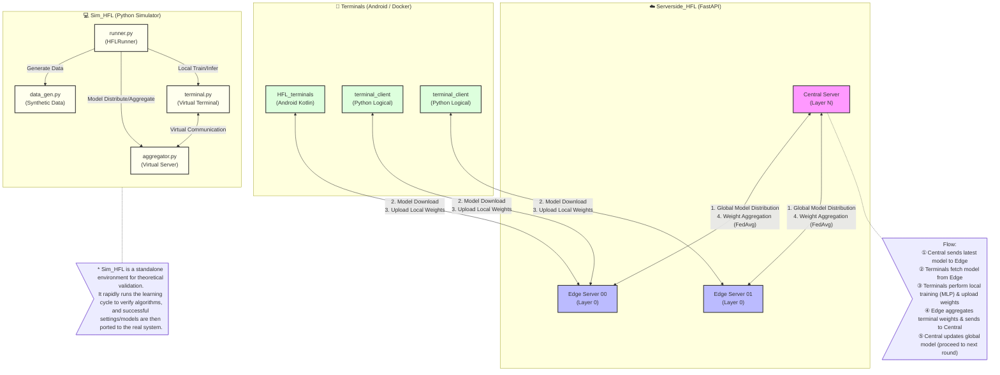

# HFL Project Architecture and Data Flow

**Date:** 2026-04-27
**Overview:** This document outlines the architectural structure and data flow of the Hierarchical Federated Learning (HFL) project, including the real-device/Docker setup and the standalone Python simulator.

## System Architecture

## Summary
1. **Server Hierarchy (`Serverside_HFL`):** Uses a two-tier structure (FastAPI) with "Edge" servers handling terminals and a "Central" server orchestrating the global model. This distributes network load while performing FedAvg weight aggregation and distribution.
2. **Clients (`HFL_terminals` / `terminal_client`):** Android smartphones or Python-based logical clients in Docker. They download the model, perform training on local data, and upload only the resulting weights to the Edge server.
3. **Simulator (`Sim_HFL`):** An independent experimental platform that runs the "Data Generation -> Training -> Aggregation -> Evaluation" cycle rapidly on a single machine without actual network communication, used for theoretical validation.