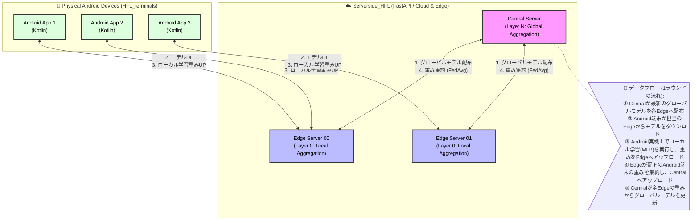

# Real-Device HFL Architecture and Data Flow

**Date:** 2026-04-27
**Overview:** This document outlines the architectural structure and data flow focusing exclusively on the real-device environment (physical Android smartphones communicating with the real Server hierarchy). Simulated environments and Docker-based logical clients are omitted.

## System Architecture (Real Devices)

## Summary
1. **クラウド・エッジインフラ（`Serverside_HFL`）:** 実環境にデプロイされたCentralサーバーとEdgeサーバー群です。Edgeが各Android端末からの通信を捌き、Centralが全体の学習（FedAvg）を統括します。
2. **実機Android端末（`HFL_terminals`）:** 物理的なスマートフォン（Android）上で動くアプリです。ユーザーの実際の通信環境やアプリ使用状況をリアルタイムで観測しながら、エッジサーバーとモデルの重みをやり取りします。
3. **データ通信の独立性:** 各Android端末が外部のAPIと通信するのは直近のEdgeサーバーのみであり、Centralサーバーとは直接通信しない階層的なプライバシー保護（HFL）アーキテクチャを実現しています。